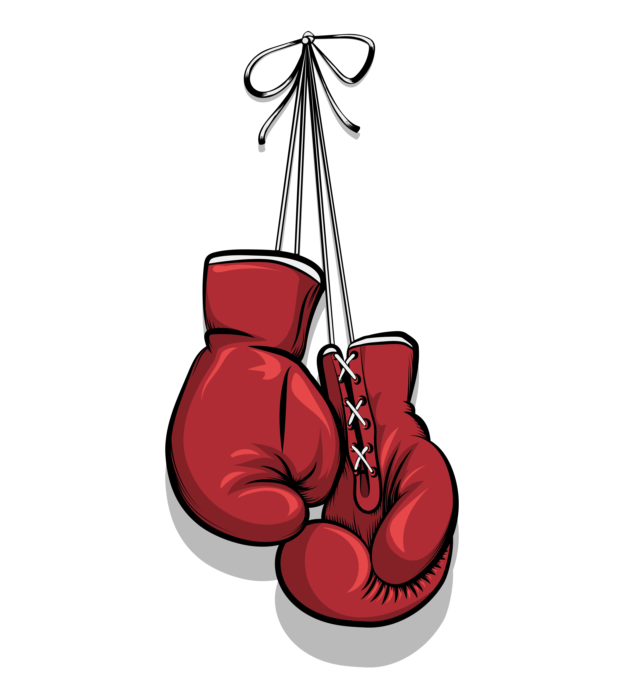

[![Contributors][contributors-shield]][contributors-url]
[![Forks][forks-shield]][forks-url]
[![Stargazers][stars-shield]][stars-url]
[![Issues][issues-shield]][issues-url]

<!-- PROJECT LOGO -->
 

  

<h3 align="center">Boxing Champions</h3>

  

    Online Boxing Judging
     
    <!--  
    <a href="https://github.com/github_username/repo_name">View Demo</a>
    · -->
    <a href="https://github.com/github_username/repo_name/issues">Report Bug</a>
    ·
    <a href="https://github.com/github_username/repo_name/issues">Request Feature</a>
  

<!-- ABOUT THE PROJECT -->
## About The Project

The boxing community is super supportive of their fighters and scoring the events. This allows a place for fights to be scheduled and can have live scoring from anyone around the world. 

[contributors-shield]: https://img.shields.io/github/contributors/github_username/repo_name.svg?style=for-the-badge
[contributors-url]: https://github.com/rileyhowley-seequent/boxing_champions/graphs/contributors
[forks-shield]: https://img.shields.io/github/forks/github_username/repo_name.svg?style=for-the-badge
[forks-url]: https://github.com/rileyhowley-seequent/boxing_champions/network/members
[stars-shield]: https://img.shields.io/github/stars/github_username/repo_name.svg?style=for-the-badge
[stars-url]: https://github.com/rileyhowley-seequent/boxing_champions/stargazers
[issues-shield]: https://img.shields.io/github/issues/github_username/repo_name.svg?style=for-the-badge
[issues-url]: https://github.com/rileyhowley-seequent/boxing_champions/issues
[license-shield]: https://img.shields.io/github/license/github_username/repo_name.svg?style=for-the-badge

